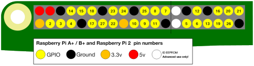

## Raspberry Pi GPIO pins

There are 40 pins on the Raspberry Pi (26 pins on early models), and they perform various different functions.

If you have a RasPiO pin label, it can help to identify what each pin is used for. Make sure your pin label is placed with the key-ring hole facing the USB ports, pointed outwards.

If you don't have a pin label, then this guide can help you to identify the pin numbers:

You'll see pins labelled as 3V3, 5V, GND, GP2, GP3, and so on:

|   |   |   |
|---|---|---|
| 3V3 | 3.3 volts | Anything connected to these pins will always get 3.3V of power |
| 5V | 5 volts | Anything connected to these pins will always get 5V of power |
| GND | ground | Zero volts. Used to complete a circuit |
| GP2 | GPIO pin 2 | These pins are for general-purpose use and can be configured as input or output pins |
| ID_SC/ID_SD/DNC | Special purpose pins ||

